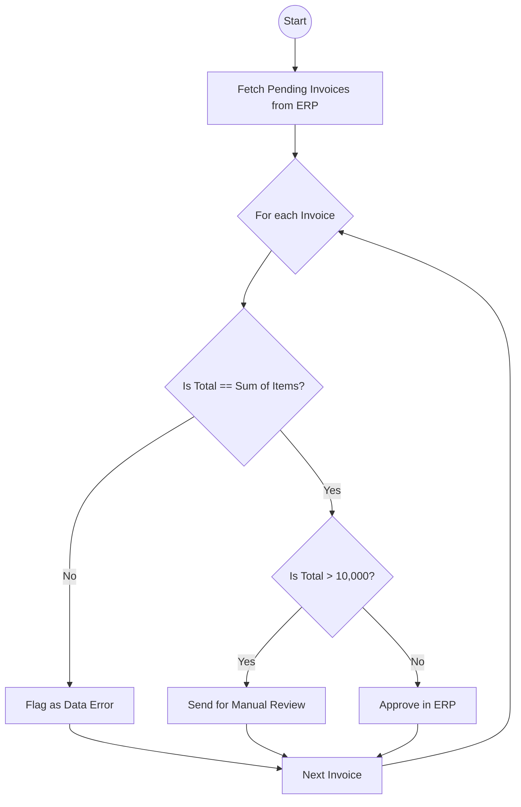

[](https://codespaces.new/21010/ae-worshop/tree/main)

# Guided Automation Project: Invoice Processing

Welcome to the hands-on guided project! In this session, you will evolve from traditional RPA script writing to **Automation Engineering**.

## 1. The Business Case & Problem

You have been tasked with automating the approval process for incoming vendor invoices.

**The Context:**
In the past, this process was handled by a legacy RPA bot that scraped a UI. It was brittle and frequently broke when the UI changed. Now, we are migrating to an API-first approach, pulling invoice payloads from an upstream system, and we need to build a robust Python backend to process them reliably.

**The Core Problems (Data Corruption & Instability):**
1. **Data Corruption:** The upstream system occasionally sends corrupted data payloads. For example, it might send correct line items ($500 and $200) but provide a mathematically incorrect total amount ($9000). If we blindly pass this to the ERP system, we corrupt our financial data.
2. **System Instability:** The target ERP system's REST API is notoriously flaky and frequently throws `503 Service Unavailable` errors. Our automation must be resilient enough to handle these network drops automatically without crashing.

**The Business Rules:**
1. Fetch pending invoices from the ERP system via its new REST API.
2. **Deterministic Validation:** Ensure the `Total Amount` exactly matches the sum of the `Line Items`. If it doesn't, reject it immediately.
3. **Thresholding:** Auto-approve the invoice in the ERP system **UNLESS** the total amount is greater than $10,000. Invoices over $10,000 require manual review.

### As-Is Process (BPMN)



---

## 2. Step-by-Step Implementation Guide

Your workspace is completely empty (except for this guide and a mock ERP API running silently in the background on `http://127.0.0.1:8080`). You will build the solution from scratch.

### Phase 0: Process Analysis & Architecture Design
Before we write a single line of code, we must analyze the process as Engineers.
*   **Requirements:** Fetch invoices, mathematically validate them, threshold them, and approve them.
*   **Risks:** The API will drop connections (503), and the data will be corrupted.
*   **Mitigation Plan:** We will implement exponential retries at the network layer, and strict deterministic validation at the data boundary.
*   **Architecture (Domain-Driven Design):** We will use the Hexagonal/DDD design pattern. We will not write a massive, 1,000-line procedural script. Instead, we will split the bot into 3 standard layers:
    1.  **Infrastructure:** Talks to the outside world (APIs).
    2.  **Domain:** Pure business rules and data models (Validation).
    3.  **Application:** The orchestrator that glues them together.

### Phase 1: Project Initialization
Modern Python relies on isolated, reproducible environments. We will use `uv` (a blazing-fast package manager) instead of heavy RPA control rooms.

1. **Initialize the project in the terminal:**
   ```bash
   uv init
   ```
2. **Add production dependencies:**
   *Why these?* We need `pydantic` because it is the modern industry standard for instantly validating JSON data structures. We need `requests` to talk to the HTTP API, and `tenacity` to effortlessly handle retry loops when the API crashes.
   ```bash
   uv add pydantic requests tenacity
   ```
3. **Add development dependencies:**
   *Why `--dev`?* Tools like `pytest` (for testing) and `ruff` (for formatting) are critical for building the bot, but they don't need to be packaged into the final production server. Keeping them separate makes our bot faster and more secure.
   ```bash
   uv add --dev pytest ruff bandit pyrefly pre-commit
   ```
4. **Analyze the Configuration:**
   Open the newly generated `pyproject.toml` file. Notice how `uv` automatically tracked your dependencies. This file is the single source of truth for your bot's environment!

### Phase 2: Code Quality & Pre-commit
We want to automatically format our code and catch security issues before they are ever committed to Git.

1. **Initialize Git and enforce the 'main' branch standard:**
   ```bash
   git init
   git branch -M main
   ```
2. **Setup pre-commit using our local tools:**
   Create a file named `.pre-commit-config.yaml` in the root directory. *Notice how we configure the hooks to execute locally via `uv run` to guarantee they use our exact environment versions.*
   
   <details>
   <summary><b>💡 Click here to copy the pre-commit configuration</b></summary>
   
   ```yaml
   repos:
     - repo: local
       hooks:
         - id: ruff
           name: ruff
           entry: uv run ruff check --fix
           language: system
           types: [python]
           require_serial: true
         - id: ruff-format
           name: ruff-format
           entry: uv run ruff format
           language: system
           types: [python]
         - id: bandit
           name: bandit
           entry: uv run bandit -c pyproject.toml -r .
           language: system
           types: [python]
         - id: pyrefly
           name: pyrefly
           entry: uv run pyrefly
           language: system
           types: [python]
     - repo: https://github.com/trufflesecurity/trufflehog
       rev: v3.73.0
       hooks:
         - id: trufflehog
   ```
   </details>
3. **Install the hooks:** `uv run pre-commit install`

### Phase 3: Project Structure (DDD)
Based on our Phase 0 design, we must construct the architecture that isolates our business logic from the flaky APIs.

1. **Create the directories (Windows PowerShell):**
   ```powershell
   New-Item -ItemType Directory -Force -Path src/domain, src/application, src/infrastructure, tests/unit, tests/integration
   ```
2. **Make them Python packages:**
   Create an empty `__init__.py` file inside each folder. 
   *Why?* Without this file, Python sees a normal folder, not a module. By adding `__init__.py`, Python can import code across files. (Smart trick: You can also use this file to explicitly expose public classes, so imports look like `from src.domain import Invoice` instead of digging deep into sub-files!).
   ```powershell
   New-Item -ItemType File -Force -Path src/domain/__init__.py, src/application/__init__.py, src/infrastructure/__init__.py, tests/__init__.py
   ```

3. **Verify the Architecture Structure:**
   By the end of this workshop, your project tree will look exactly like this:
   ```text
   📦 project-root
   ┣ 📂 src/
   ┃ ┣ 📂 domain/         # Phase 4: Core business logic and pure data validation (Pydantic)
   ┃ ┃ ┗ 📜 __init__.py
   ┃ ┣ 📂 infrastructure/ # Phase 5: External API clients and network resilience (Tenacity)
   ┃ ┃ ┗ 📜 __init__.py
   ┃ ┗ 📂 application/    # Phase 6: The orchestrator that glues Domain & Infrastructure together
   ┃   ┗ 📜 __init__.py
   ┣ 📂 tests/
   ┃ ┣ 📂 unit/           # Fast tests for pure business logic (no network required)
   ┃ ┃ ┗ 📜 __init__.py
   ┃ ┗ 📂 integration/    # Complex tests using Mock APIs to prove the orchestrator works
   ┃   ┗ 📜 __init__.py
   ┣ 📜 .pre-commit-config.yaml # Phase 2: Security and formatting guardrails
   ┗ 📜 pyproject.toml          # Phase 1: Environment and dependency definitions
   ```

### Phase 4: Building the Domain (Data Validation)
Data modeling is arguably the most important step in automation. Generic dictionaries allow corrupted data to infiltrate the system. By strictly defining the shape of an Invoice using `pydantic`, any bad payloads from the upstream system will be caught and destroyed immediately at the boundary.

1. **Create `src/domain/models.py`:**
   *Challenge: Try to write the `LineItem` and `Invoice` Pydantic models yourself! Use the `@model_validator(mode="after")` decorator to sum the line items and raise a `ValueError` if the math is wrong.*
   
   <details>
   <summary><b>💡 Click here to show the solution snippet</b></summary>
   
   ```python
   from pydantic import BaseModel, model_validator

   class LineItem(BaseModel):
       description: str
       amount: float

   class Invoice(BaseModel):
       id: str
       vendor: str
       currency: str
       line_items: list[LineItem]
       total_amount: float

       @model_validator(mode="after")
       def check_math(self):
           calculated_total = sum(item.amount for item in self.line_items)
           if calculated_total != self.total_amount:
               raise ValueError(f"Math Error! Total {self.total_amount} != Sum {calculated_total}")
           return self
   ```
   </details>

2. **Write Unit Tests (`tests/unit/test_domain.py`):**
   *Challenge: Write a Pytest function labeled `@pytest.mark.unit`. Create an invoice with bad math and use `with pytest.raises(ValueError):` to prove your validation catches it!*
   
   <details>
   <summary><b>💡 Click here to show the solution snippet</b></summary>
   
   ```python
   import pytest
   from src.domain.models import Invoice, LineItem

   @pytest.mark.unit
   def test_bad_math_is_rejected():
       with pytest.raises(ValueError):
           Invoice(
               id="1", vendor="A", currency="USD",
               line_items=[LineItem(description="Item", amount=50)],
               total_amount=9000  # Data Corruption!
           )
   ```
   </details>
3. **Run the test:** `uv run pytest -m unit`

### Phase 5: Infrastructure (The Flaky Outside World)
In Domain-Driven Design, the Infrastructure layer is the absolute edge of your application. It is the only place allowed to talk to the messy, unpredictable outside world (APIs, databases, file systems). 

*Theory Link:* In Phase 0, we identified that the target ERP system is unstable (throws 503 errors). The 12-Factor App methodology states we must treat backing services robustly. Instead of writing custom retry loops, we will use the `tenacity` library to automatically handle network drops using exponential backoff.

1. **Create `src/infrastructure/api_client.py`:**
   *Challenge: Create a `FastAPIClient` class. Write a GET method to fetch `http://127.0.0.1:8080/api/invoices/pending`. Notice how it immediately converts the raw JSON into the `Invoice` Pydantic model you built in Phase 4! Then, write a POST method to approve an invoice, decorated with `@retry` from `tenacity`.*
   
   <details>
   <summary><b>💡 Click here to show the solution snippet</b></summary>
   
   ```python
   import requests
   from tenacity import retry, stop_after_attempt, wait_exponential
   from src.domain.models import Invoice

   class FastAPIClient:
       def fetch_pending_invoices(self) -> list[Invoice]:
           response = requests.get("http://127.0.0.1:8080/api/invoices/pending")
           response.raise_for_status()
           return [Invoice(**item) for item in response.json()]

       @retry(stop=stop_after_attempt(3), wait=wait_exponential(multiplier=1))
       def approve_invoice(self, invoice_id: str) -> bool:
           response = requests.post(f"http://127.0.0.1:8080/api/invoices/{invoice_id}/approve")
           response.raise_for_status()
           return True
   ```
   </details>

### Phase 6: Application Layer (The Orchestrator)
The Application Layer is the "Conductor" of the orchestra. It doesn't know *how* to validate math (the Domain does that), and it doesn't know *how* to make HTTP requests (the Infrastructure does that). It simply orchestrates the flow and applies high-level business rules (like our $10,000 threshold limit).

*Theory Link (SOLID Principles):* The 'D' in SOLID stands for **Dependency Inversion**. If our orchestrator imports the `FastAPIClient` directly, they become tightly coupled. If we ever migrate to SAP or Salesforce, the orchestrator breaks. Instead, we define a `Protocol` (an interface). The orchestrator only knows it needs *something* that can fetch and approve invoices.

1. **Create `src/application/processor.py`:**
   *Challenge: Create an `InvoiceProcessor`. Define an `InvoiceAPIClient(Protocol)` rather than hardcoding the FastAPI client. Write a `run()` method that loops through the invoices and only approves them if they are under $10,000.*
   
   <details>
   <summary><b>💡 Click here to show the solution snippet</b></summary>
   
   ```python
   import logging
   from src.domain.models import Invoice
   from typing import Protocol

   logger = logging.getLogger(__name__)

   # SOLID: Dependency Inversion. We don't care HOW the API works, just that it has these methods.
   class InvoiceAPIClient(Protocol):
       def fetch_pending_invoices(self) -> list[Invoice]: ...
       def approve_invoice(self, invoice_id: str) -> bool: ...

   class InvoiceProcessor:
       def __init__(self, api_client: InvoiceAPIClient):
           self.api_client = api_client
           self.threshold = 10000.0

       def run(self):
           invoices = self.api_client.fetch_pending_invoices()
           for inv in invoices:
               if inv.total_amount > self.threshold:
                   logger.warning(f"Manual Review required for {inv.id}")
               else:
                   self.api_client.approve_invoice(inv.id)
                   logger.info(f"Approved {inv.id}")
   ```
   </details>

### Phase 7: Integration Testing (No Network Required!)
Testing automation bots is notoriously difficult because they usually require logging into live UI systems. Because we engineered a clean DDD architecture with Dependency Inversion, we have achieved ultimate **Testability** (CUPID principles). We can test our entire business logic without ever touching the network!

*Theory Link:* Because our `InvoiceProcessor` in Phase 6 only requires an object matching the `InvoiceAPIClient(Protocol)`, we can pass it a fake "Mock" client that stores data in memory instead of making real HTTP requests. 

1. **Create `tests/integration/test_processor.py`:**
   *Challenge: Write a `MockAPIClient` class that returns fake memory invoices instead of hitting the network. Pass it into the `InvoiceProcessor` and assert that an invoice over $10,000 is NOT approved!*
   
   <details>
   <summary><b>💡 Click here to show the solution snippet</b></summary>
   
   ```python
   import pytest
   from src.application.processor import InvoiceProcessor
   from src.domain.models import Invoice, LineItem

   # A fake API client for testing!
   class MockAPIClient:
       def __init__(self):
           self.approved_invoices = []
           
       def fetch_pending_invoices(self):
           return [
               Invoice(id="CHEAP-1", vendor="A", currency="USD", line_items=[LineItem(description="X", amount=5)], total_amount=5),
               Invoice(id="EXPENSIVE-1", vendor="A", currency="USD", line_items=[LineItem(description="X", amount=20000)], total_amount=20000)
           ]
           
       def approve_invoice(self, invoice_id: str):
           self.approved_invoices.append(invoice_id)
           return True

   @pytest.mark.integration
   def test_processor_approves_under_threshold_only():
       client = MockAPIClient()
       processor = InvoiceProcessor(client)
       processor.run()
       
       # It should approve CHEAP-1, but block EXPENSIVE-1
       assert "CHEAP-1" in client.approved_invoices
       assert "EXPENSIVE-1" not in client.approved_invoices
   ```
   </details>
2. **Run the integration test:** 
   Execute `uv run pytest -m integration` in your terminal. 
   *(Note: If Pytest throws a yellow warning about "unknown markers", try creating a `pytest.ini` file in the root directory to officially register them!)*

### Phase 8: The Entry Point (Running the Bot)
We have built our architecture, but we need a lightweight trigger to actually start the process. In traditional scripts, everything is jammed into one massive file. In our DDD architecture, the entry point simply wires the layers together using **Dependency Injection** and hits "Go".

1. **Create `task.py` in the root directory:**
   *Challenge: Create the main execution file. Import the real `FastAPIClient` and the `InvoiceProcessor`. Instantiate the client, pass it into the processor, and call `run()`!*
   
   <details>
   <summary><b>💡 Click here to show the solution snippet</b></summary>
   
   ```python
   import logging
   from src.infrastructure.api_client import FastAPIClient
   from src.application.processor import InvoiceProcessor

   # Configure logging so we can see the output in the terminal
   logging.basicConfig(level=logging.INFO, format="%(levelname)s: %(message)s")

   def main():
       print("🚀 Starting Invoice Processing Bot...")
       
       # 1. Initialize the real Infrastructure client
       api_client = FastAPIClient()
       
       # 2. Inject it into the Application orchestrator (Dependency Injection)
       processor = InvoiceProcessor(api_client)
       
       # 3. Execute the business logic
       processor.run()
       
       print("✅ Processing Complete!")

   if __name__ == "__main__":
       main()
   ```
   </details>

2. **Execute your completed bot:** 
   Run the process using `uv` to ensure it executes securely inside your isolated environment:
   ```bash
   uv run task.py
   ```

### Phase 9: Observability (Replacing the Legacy log.html)
Legacy RPA frameworks generate static `log.html` or `stdout.log` files on the local hard drive. The **12-Factor App** principles state this is an anti-pattern in the cloud because containers are ephemeral (they get deleted when finished). 

Instead, modern applications output **Structured JSON Logs** to the terminal stream. Log routers (like Datadog, Splunk, or Promtail) capture this stream automatically.

1. **Add the modern logging library:**
   ```bash
   uv add structlog
   ```
2. **Update your Orchestrator (`src/application/processor.py`):**
   *Challenge: Replace the standard `logging` with `structlog`. Notice how we `bind()` variables like `invoice_id` to the logger so every log line automatically includes that context in the JSON payload!*
   
   <details>
   <summary><b>💡 Click here to show the solution snippet</b></summary>
   
   ```python
   import structlog
   from src.domain.models import Invoice
   from typing import Protocol

   logger = structlog.get_logger()

   class InvoiceAPIClient(Protocol):
       def fetch_pending_invoices(self) -> list[Invoice]: ...
       def approve_invoice(self, invoice_id: str) -> bool: ...

   class InvoiceProcessor:
       def __init__(self, api_client: InvoiceAPIClient):
           self.api_client = api_client
           self.threshold = 10000.0

       def run(self):
           invoices = self.api_client.fetch_pending_invoices()
           logger.info("fetched_invoices", count=len(invoices))

           for inv in invoices:
               # Bind the ID to the logger so it attaches to all subsequent logs!
               log = logger.bind(invoice_id=inv.id)
               log.info("processing_invoice")
               
               if inv.total_amount > self.threshold:
                   log.warning("manual_review_required", amount=inv.total_amount)
               else:
                   self.api_client.approve_invoice(inv.id)
                   log.info("invoice_approved")
   ```
   </details>

3. **Update your Entry Point (`task.py`):**
   *Challenge: Configure `structlog` to output as JSON with an ISO timestamp.*
   
   <details>
   <summary><b>💡 Click here to show the solution snippet</b></summary>
   
   ```python
   import structlog
   from src.infrastructure.api_client import FastAPIClient
   from src.application.processor import InvoiceProcessor

   def main():
       # Configure the 12-Factor JSON log stream
       structlog.configure(
           processors=[
               structlog.processors.TimeStamper(fmt="iso"),
               structlog.processors.JSONRenderer()
           ]
       )
       
       logger = structlog.get_logger()
       logger.info("bot_starting")
       
       api_client = FastAPIClient()
       processor = InvoiceProcessor(api_client)
       processor.run()
       
       logger.info("bot_finished")

   if __name__ == "__main__":
       main()
   ```
   </details>

4. **Run the bot:**
   Execute `uv run task.py`. Look at the terminal! You will see beautiful, machine-readable JSON logs that cloud dashboards can instantly query.

### Phase 10: Enterprise Deployment (Azure Architecture)
Now that your bot is perfectly engineered, how do you deploy it to production? Because we strictly followed the **12-Factor App** principles, this Python codebase is 100% portable. Here are the 4 standard ways to deploy this in a Microsoft Azure ecosystem:

**1. On-Premises Server (Hybrid Cloud)**
*   **How:** If the ERP system is locked behind a strict corporate firewall, run the bot on a local Windows Server using Task Scheduler (`uv run task.py`).
*   **Telemetry:** Install the `azure-monitor-opentelemetry` package and add `configure_azure_monitor()` to your `task.py`. The bot will securely stream its structured JSON logs out of your private network directly into **Azure Application Insights**.

**2. Azure Container Apps or AKS (Cloud Native)**
*   **How:** Package the repository into a Docker container and deploy it to Azure Container Apps as a background job.
*   **Telemetry:** The Azure infrastructure automatically captures the JSON `stdout` terminal stream we built in Phase 9. You get perfect Application Insights integration with **zero code changes**.

**3. Azure Functions (Serverless)**
*   **How:** Wrap the `processor.run()` logic inside a Time-Triggered Azure Function (e.g., scheduled to run every 15 minutes). 
*   **Pros:** You only pay for the exact milliseconds the bot is processing invoices. If there are no invoices, it costs $0.
*   **Cons:** Serverless functions have execution time limits (usually 10 minutes). If your bot needs to process 10,000 invoices in a single run, you would need to use Azure Durable Functions.

**4. Azure Logic Apps (Low-Code Orchestration)**
*   **How:** Sometimes the upstream ERP system requires complex, legacy XML SOAP authentication. Let a Logic App handle the messy trigger and authentication steps. The Logic App can fetch the data and then trigger your Python bot (hosted in an Azure Function) just to execute the heavy Pydantic math validation. 

🎉 **Congratulations!** You have just engineered a modern, tested, and resilient Python automation!
